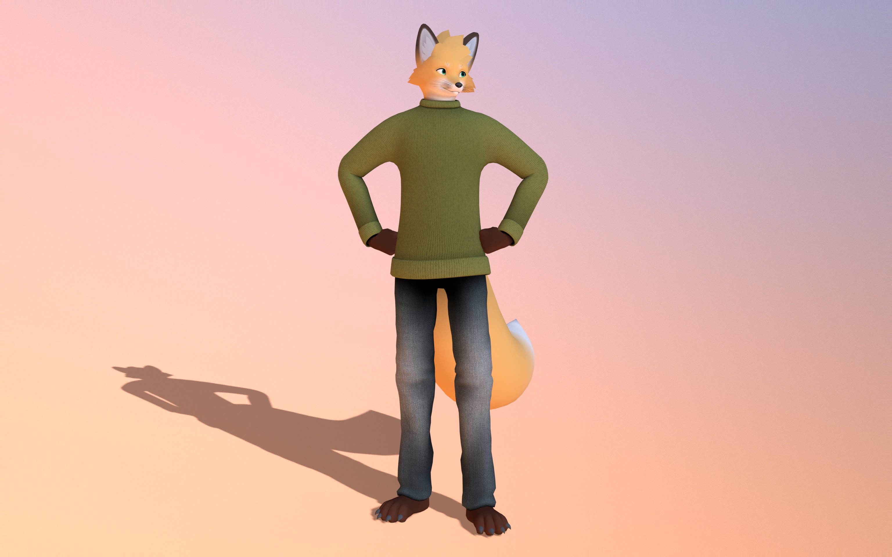

# **Roan**

## [VRChat](https://hello.vrchat.com/) furry fox avatar.
___

<b>Media (tag 3.0-rc-2)</b>

  
  
  

  ### [:arrow_forward:Sketchfab Preview (tag 3.0)](https://skfb.ly/pAzHI)

___

# А Request
I don't expect this avatar to be widely used, but just in case:

**Please do not use this model to post pornographic or suggestive content.  
I would also appreciate it if you would credit me as the author if you ever upload/post him anywhere (modified or not).**

*About all mistakes and wishes or criticism write me safely. I will be interested to answer everything or realize that I have created some silly thing :D*

# Get

### [:arrow_forward:Download Project](https://github.com/strakacher21/Roan/releases)

## Avatar Links

### [:arrow_forward:Link to the VRChat avatar (tag 3.0)](https://vrchat.com/home/avatar/avtr_2a8b73c0-5a67-499c-b3f3-67398d269035)

### [:arrow_forward:Link to the VRChat *Lab Edition* avatar](https://vrchat.com/home/avatar/avtr_22ba3ed9-6d23-4b79-b70d-9b3035305bbb)
(where I test the latest changes)

___
# Info

The project includes the **Blend 5.0** file itself and the **Unity 2022.3.22f1** project.

> [!WARNING]
> **To properly export a model from Blender to Unity, use the built-in `Export to Unity` custom tool in Blender!**  
> Click **Export to Unity** in Blender’s 3D Viewport header (Workspace: **Layout**) to open the export popover.
> Press **Export to Unity!** to export to Unity in one click.
>
> To properly configure your Unity project, use this **[:bulb:Unity project setup guide](Unity-setup.md)**.

The **Unity project** has a **prefab model**, as well as two **scenes** for **PC** and **Quest&IOS** *(Currently, both scenes are the same. Separate scenes are kept for future platform-specific adjustments)*.  
**Texture quality switching** *(currently disabled on the avatar prefab)*: switching scenes via **SceneLabel** can auto-apply per-scene texture max sizes (e.g., 4K → 2K).

Аlso includes **AnimatorWizard** script (attached to the avatar prefab). That allows you to customise gestures, facial expressions, eye/face tracking, etc. You can disable some features to save [VRChat parameters](https://creators.vrchat.com/avatars/animator-parameters/#custom-parameters).

<!---
# TODO
### Global:
- [x] full face tracking support ([VRCFT](https://docs.vrcft.io/docs/intro))
- [x] UV map for textures
- [ ] сreate textures (something better than that regular vertex paint!) ***(working on it)***
- [ ] optimize the character mesh, add details, and also need to work on his style ***(working on it)***
- [ ] grooming hair (in Blender only)
- [ ] add body geometry?
- [ ] add different clothes?
___

### Minor:
- [ ] make an adequate "weight paint" for the whole character to move better!
- [ ] revise visemes
- [x] create simple expressions
- [ ] revise the character's physical bones
- [x] add expressions menu, FX, Additive (now they don't exist at all, lol)
- [ ] idle anims
- [ ] adapt [AnimatorWizard](https://github.com/strakacher21/Roan/blob/main/Roan%20unity%20project/Assets/scripts/AnimatorWizard.cs) script for this project
- [ ] make locomotion better!
- [ ] [VRM](https://vrm.dev/en/vrm/vrm_about/) file?
-->

## Attribution
[**AnimatorWizard**](https://github.com/strakacher21/vrcfox-2.3_body_and_cloth_edition/blob/main/vrcfox%20unity%20project%20(B%26C)/Assets/scripts/AnimatorWizard.cs) script uses the [v3-animator-as-code](https://github.com/hai-vr/av3-animator-as-code) [(hai-vr)](https://github.com/hai-vr) package to set up animators. **OSC smooth** in AnimatorWizard was inspired by the idea from the [OSCmooth project ](https://github.com/regzo2/OSCmooth)[(regzo2)](https://github.com/regzo2). Also uses parts of [VRLabs Avatars 3.0 Manager](https://github.com/VRLabs/Avatars-3.0-Manager) [(AnimatorCloner)](https://github.com/VRLabs/Avatars-3.0-Manager/blob/main/Editor/AnimatorCloner.cs) to “reset” AnimatorWizard-generated FX/Gesture/Additive controllers and remove hidden garbage that accumulates in animator assets over time.

The texture of the pants and sweater was taken from: [ambientCG](https://ambientcg.com).  
The hdr of the preview image was taken from [sketchfab](https://github.com/sketchfab/sketchfab-legacy-environments).